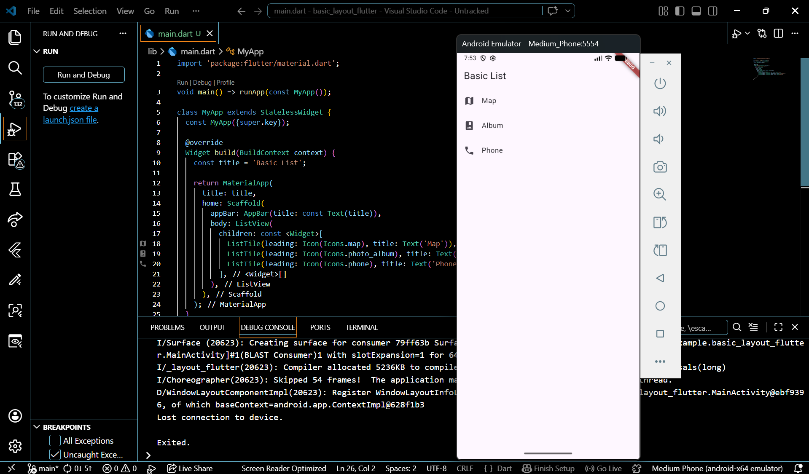
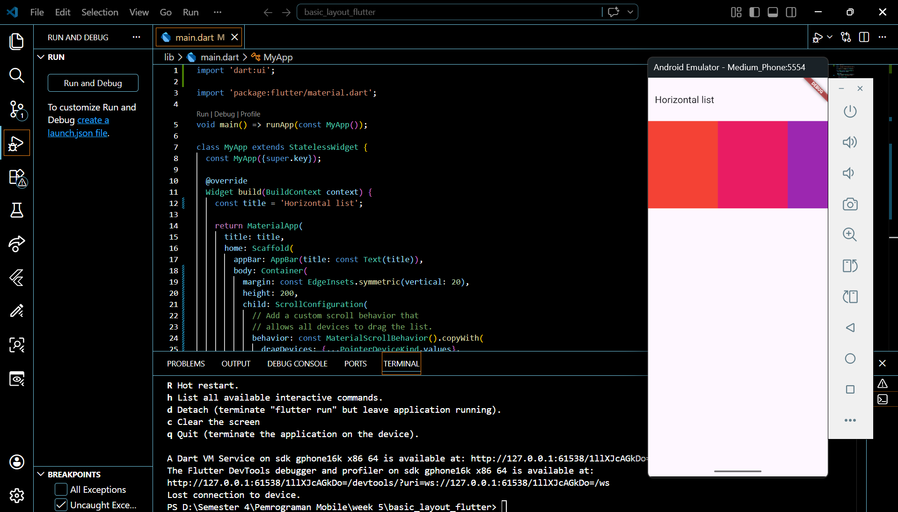
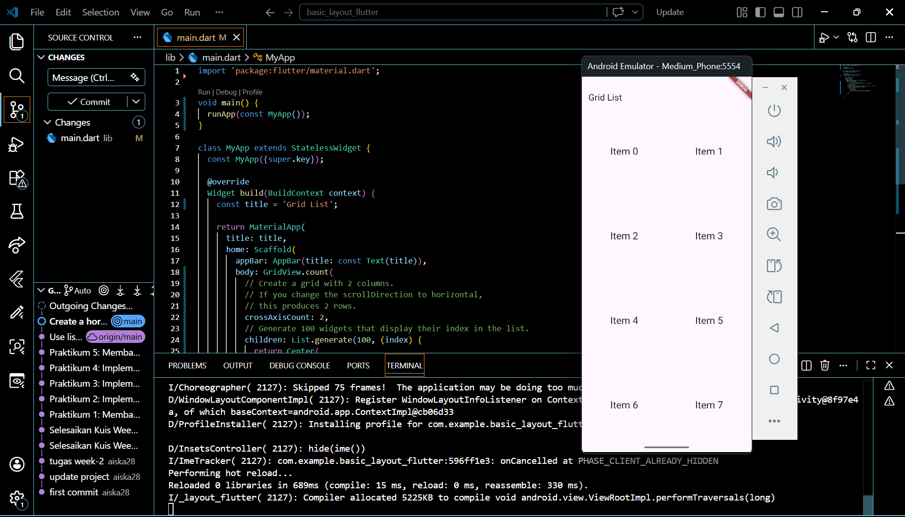
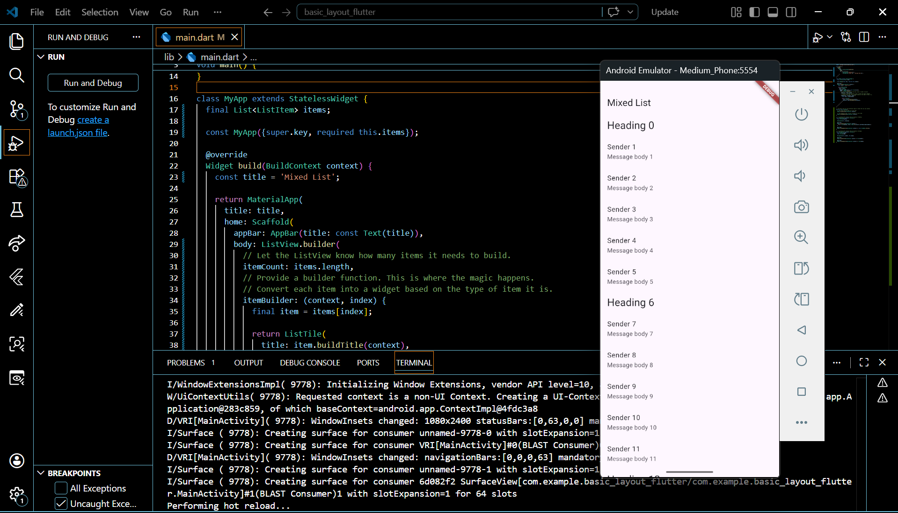
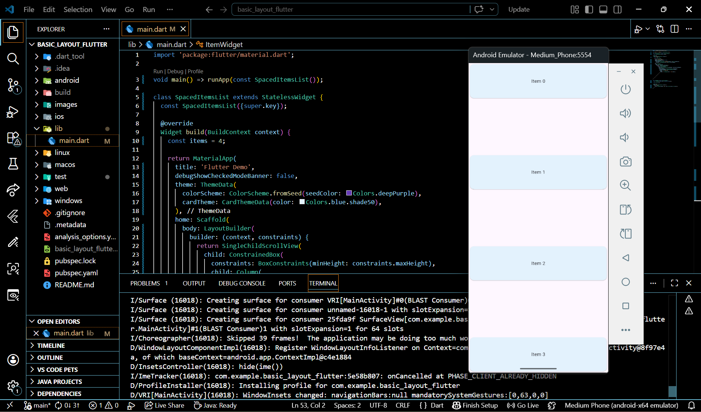
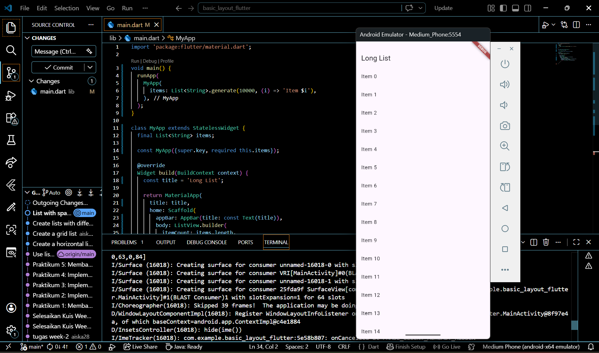
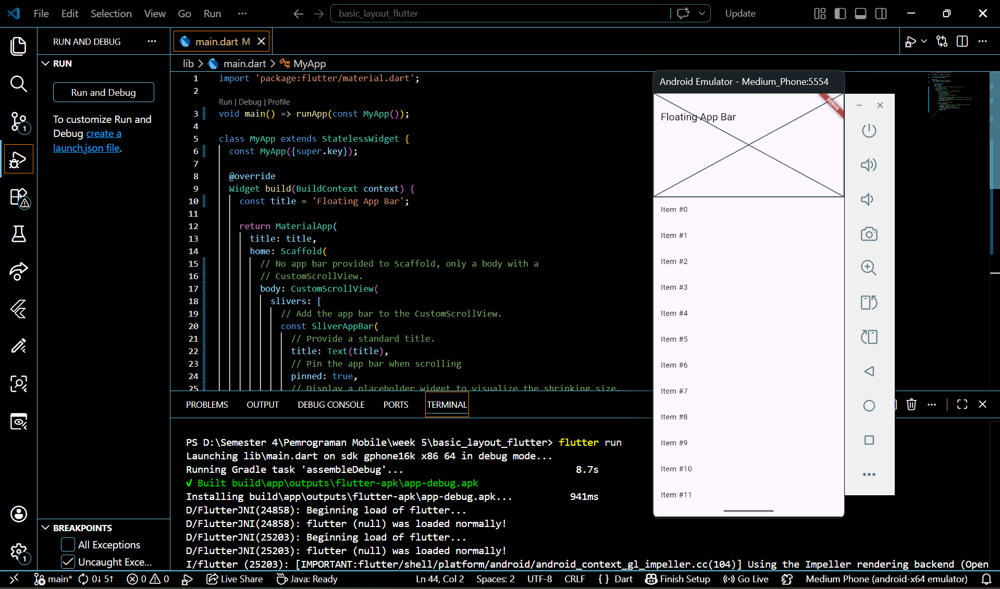
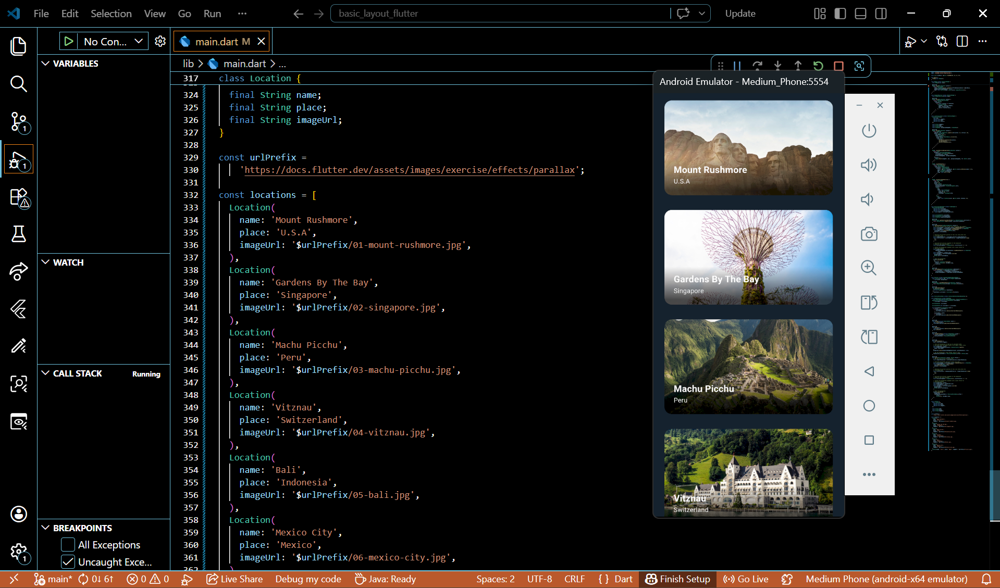

# basic_layout_flutter

A new Flutter project.

## Getting Started

Name : Aiska Oca Amalia
Class : SIB 2G
NIM : 244107060035

Displaying lists of data is a fundamental pattern for mobile apps. Flutter includes the ListView widget to make working with lists a breeze.

Use the standard ListView constructor, passing in a horizontal scrollDirection, which overrides the default vertical direction.

Using the GridView.Count() constructor makes it easy to specify the desired number of rows or columns.

create lists that display different types of content. create an app that shows a header followed by five messages. Therefore, create three classes: ListItem, HeadingItem, and MessageItem.

use LayoutBuilder and ConstrainedBox to space out list items evenly when there is enough space, and to allow users to scroll when there is not enough space

The standard ListView constructor works well for small lists. To work with lists that contain a large number of items, it's best to use the ListView.builder constructor. In contrast to the default ListView constructor, which requires creating all items at once, the ListView.builder() constructor creates items as they're scrolled onto the screen.

Add items to the CustomScrollView.

create the parallax effect by building a list of cards (with rounded corners containing some text). Each card also contains an image. As the cards slide up the screen, the images within each card slide down.
