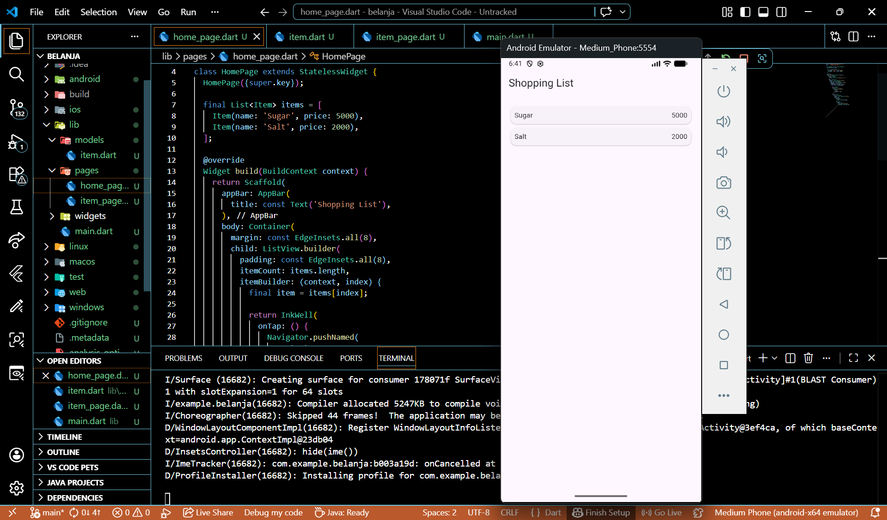
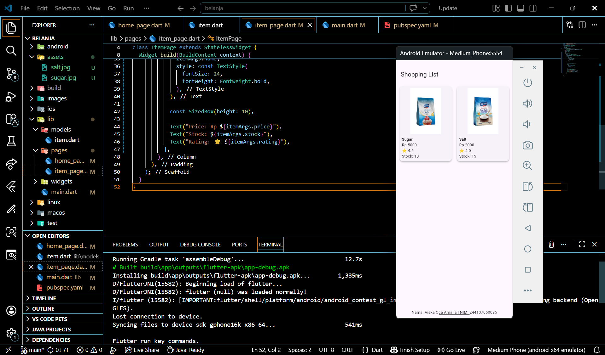
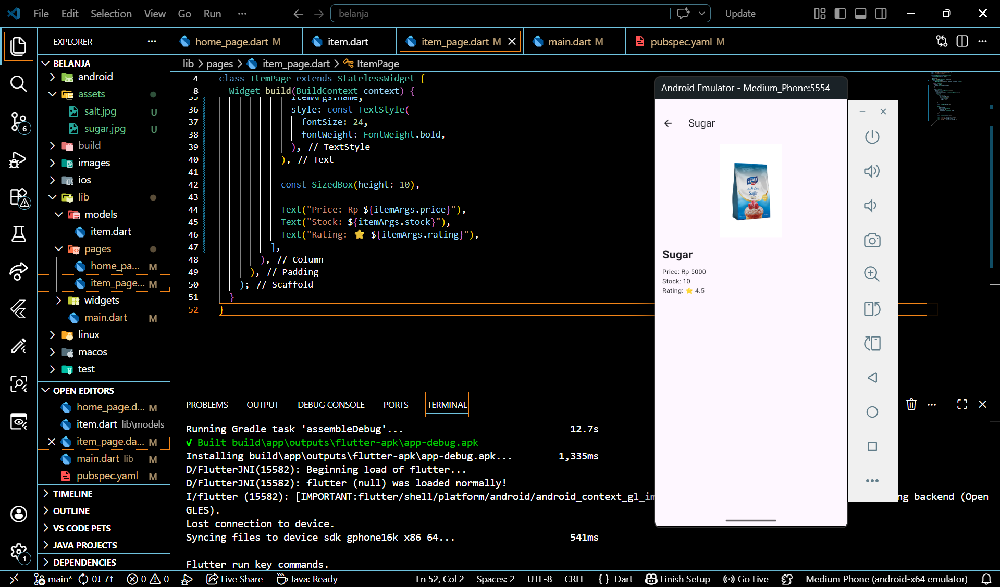

# belanja

A new Flutter project.

## Getting Started

Name : Aiska Oca Amalia
Class : SIB 2G
NIM : 244107060035



Create a multi-page mobile app. The app being developed is a shopping list application. In this app, the screen will transition and send data to other pages. When an item is tapped, the data will be sent to the next page.



In the next step, images were added to each item.

This app uses the go_router package instead of the standard Navigator.
Navigation is handled by:
```dart
context.push('/item', extra: item);