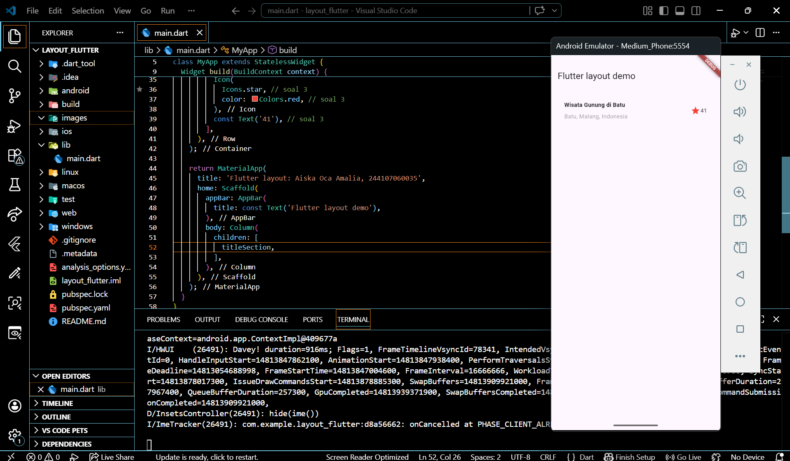
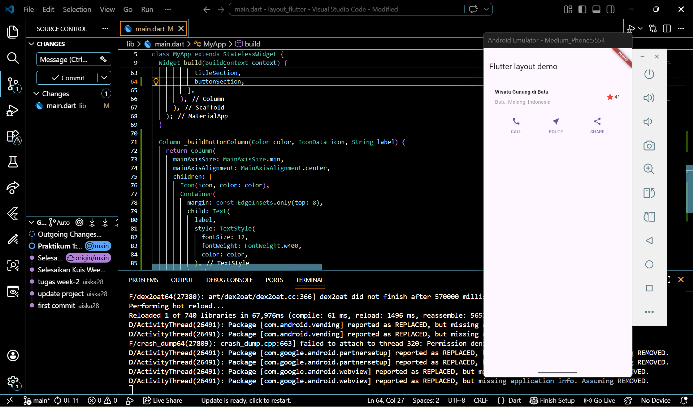
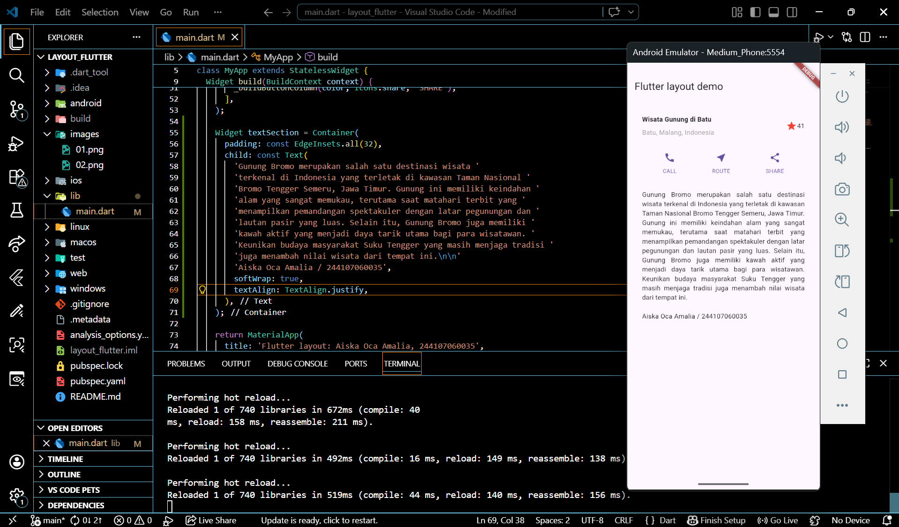
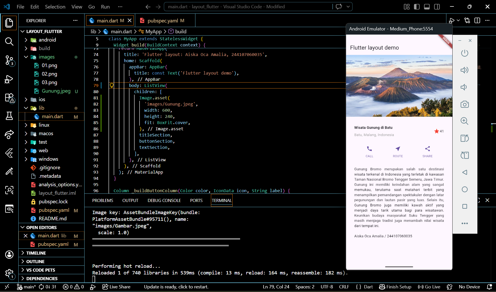

# layout_flutter

A new Flutter project.

## Getting Started

Name : Aiska Oca Amalia
Class : SIB 2G
NIM : 244107060035

In this step, we create the left column in the header. Learn how to adjust the column widget using the crossAxisAlignment property to CrossAxisAlignment.start;
then add a color and a star icon.

This section places an icon above the text row. The columns in the row are spaced evenly, and the text and icons are colored in the primary color. Next, create a function to add an icon to a column. Align the columns along the main axis using `MainAxisAlignment.spaceEvenly` to distribute the spacing evenly before, between, and after each column.

insert text into the container and add padding around its edges. 

add an image