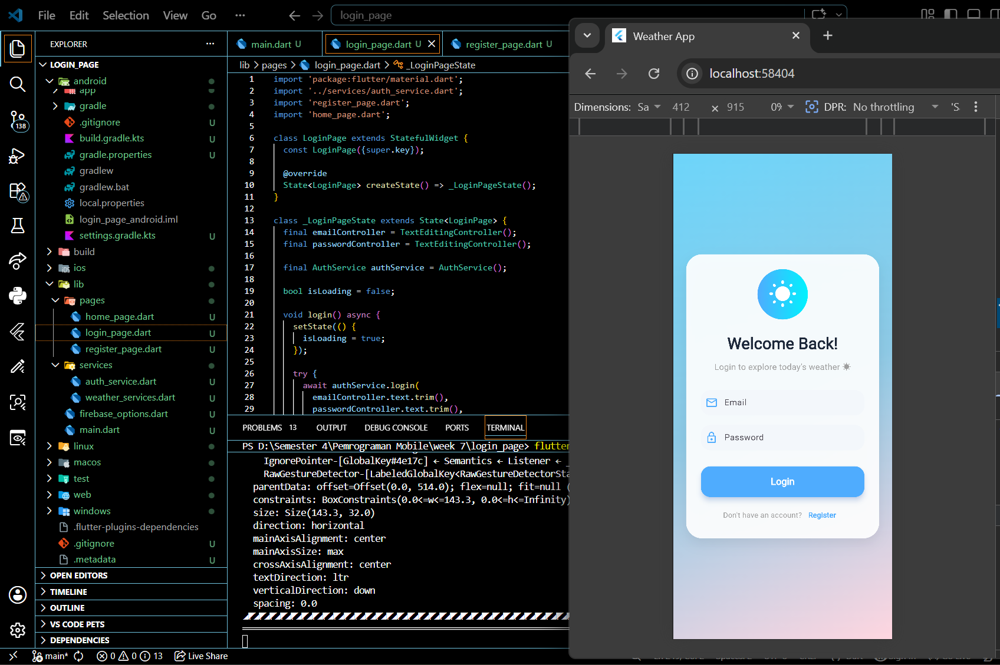
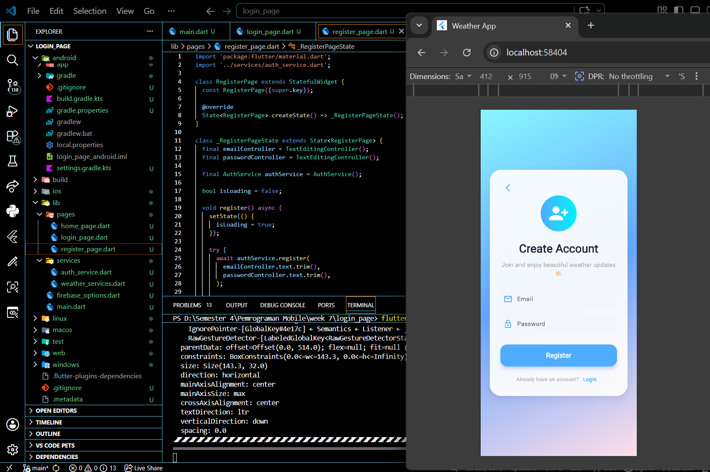
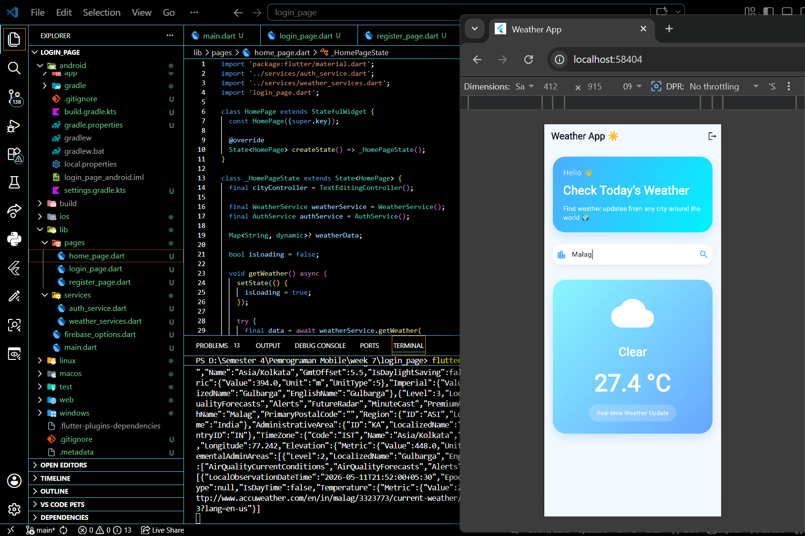

# login_page

A new Flutter project.

## Getting Started

This project is a starting point for a Flutter application.

Name    : Aiska Oca Amalia
Class   : SIB 2G
NIM     : 244107060035

# Firebase Integration on Flutter Project

## Percobaan Integrasi Firebase pada Flutter

Pada percobaan ini dilakukan proses integrasi Firebase ke dalam project Flutter untuk mendukung fitur autentikasi dan database cloud.

==== Langkah-Langkah Percobaan ===

1. Membuat project baru pada Firebase Console dengan nama:
   - `Flutter-login`
2. Mengaktifkan fitur Firebase:
   - Authentication (Email/Password)
   - Firestore Database
3. Menentukan lokasi database:
   - `asia-southeast2 (Jakarta)`
4. Menambahkan dependency Firebase pada project Flutter:
   ```bash
   flutter pub add firebase_core
   flutter pub add firebase_auth
   flutter pub add cloud_firestore
5. Menginstall Node.js dan npm untuk mendukung Firebase CLI.
6. Menginstall Firebase CLI:
    - 'npm install -g firebase-tools'
7. Login ke Firebase CLI
8. Menginstall FlutterFire CLI:
    - 'dart pub global activate flutterfire_cli'
9. Menghubungkan project Flutter dengan Firebase:
    -'flutterfire configure'
10. File konfigurasi Firebase berhasil dibuat, Menginisialisasi Firebase pada main.dart menggunakan:
    -'await Firebase.initializeApp(
  options: DefaultFirebaseOptions.currentPlatform,
);'

Pada praktikum ini dilakukan pengembangan aplikasi mobile menggunakan framework Flutter dengan menerapkan konsep autentikasi pengguna dan integrasi REST API.

Aplikasi ini memiliki beberapa halaman utama yaitu halaman login, halaman register, dan halaman home. Halaman login digunakan untuk masuk ke aplikasi menggunakan email dan password yang telah terdaftar. Halaman register digunakan untuk membuat akun baru. Setelah berhasil login, pengguna akan diarahkan ke halaman home yang berfungsi untuk mencari dan menampilkan informasi cuaca berdasarkan nama kota yang dimasukkan pengguna.


pada gamabr ini menampilkan halaman landing, berupa login untuk user.


Jika user belum memiliki akun, maka diharuskan untuk melakukan register terlebih dahulu.


Pada halaman home ini menampilkan aplikasi yang dirancang menggunakan konsep UI modern dengan warna yang cerah dan tampilan yang responsif agar memberikan pengalaman pengguna yang lebih menarik. Informasi cuaca yang ditampilkan meliputi kondisi cuaca dan suhu dalam satuan Celcius secara realtime.

Melalui praktikum ini diperoleh pemahaman mengenai proses integrasi Firebase ke dalam Flutter, penggunaan REST API, pengolahan data JSON, pembuatan antarmuka modern, serta implementasi navigasi antar halaman pada aplikasi mobile.


A few resources to get you started if this is your first Flutter project:

- [Learn Flutter](https://docs.flutter.dev/get-started/learn-flutter)
- [Write your first Flutter app](https://docs.flutter.dev/get-started/codelab)
- [Flutter learning resources](https://docs.flutter.dev/reference/learning-resources)

For help getting started with Flutter development, view the
[online documentation](https://docs.flutter.dev/), which offers tutorials,
samples, guidance on mobile development, and a full API reference.
